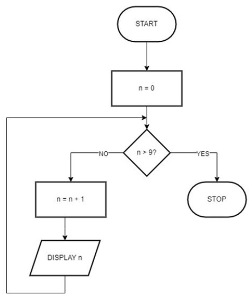

# Flytdiagram

Flytdiagram viser en visuell representasjon av en algoritme eller et program.
Vi sier gjerne at et flytdigram viser _flyten_ i en algoritme eller et program.

## Eksempel


## Symboler

| Symbol                                       | Navn         | Beskrivelse                                                                                                                                                             |
| -------------------------------------------- | ------------ | ----------------------------------------------------------------------------------------------------------------------------------------------------------------------- |
|         | Flowline     | Viser rekkefølgen på operasjoner. En linje går fra ett symbol og peker på et annet. Pilspissen kan droppes hvis flyten går ovenfra og ned, eller fra venstre til høyre. |
|  | Terminal     | Start eller slutte på algoritme eller program. Inneholder vanligvis ordet "Start" eller "Slutt".                                                                        |
|    | Process      | En eller flere operasjoner, som endrer verdi, form eller plassering av data. For eksempel: `gjør alle bokstaver små`                                                    |
|              | Input/Output | Hent inn (input) eller vis (print) data.                                                                                                                                |

> [Draw.io](https://www.drawio.com/) kan brukes for å tegne flytdiagrammer.
> Du finner symbolene for flytdiagram under `flowchart` i menyen til venstre.

## Oppgaver

### Oppgave 2.5

> Oppgave 5 fra eksamnen H23

Et system som beregner billettprisen avhengig av kjøperens alder, bruker følgende regler for billettkategorier:

- Hvis brukeren er 15 år gammel eller yngre, skal brukeren få barnebillett til 30 kroner.

- Hvis brukeren er 16 år gammel eller eldre, skal brukeren få voksenbillett til 50 kroner.

- Hvis brukeren er 67 år gammel eller eldre, skal brukeren få pensjonistbillett til 35 kroner.

Lag et flytdiagram for et program der brukeren skriver inn alderen på kjøperen og programmet regner ut og skriver ut riktig billettpris.

Lag flytdiagrammet i et egnet program, og lagre det i et allment lesbart format (f.eks. pdf eller png) og legg det ved i samme mappe som filen `oppgaver-pseudokode-flytdiagram.md`.

## Oppgave 2.6

> Oppgave 4 fra eksamen V23

I figuren nedenfor finner du en illustrasjon som viser et flytskjema for en algoritme, og i _kodeboksen_ under figuren finner du fire sekvenser med pseudokode.



```pseudo
1:
SET n TO 1
WHILE n LESSER THAN OR EQUAL TO 10
  INCREMENT n
  DISPLAY n
ENDWHILE

2:
SET n TO 0
FOR hver n LESSER THAN OR EQUAL TO 10
  DISPLAY n
ENDFOR

3:
SET n TO 1
WHILE n LESSER THAN 10
  DISPLAY n
  INCREMENT n
ENDWHILE

4:
SET n TO 1
FOR hver n LESSER THAN OR EQUAL TO 10
  DISPLAY n
ENDFOR
```

Hvilken sekvens med pseudokode gir __*lik visning av output*__ som algoritmen beskrevet av flytskjemaet? Velg riktig svar:

- [ ] 1
- [ ] 2
- [ ] 3
- [ ] 4
